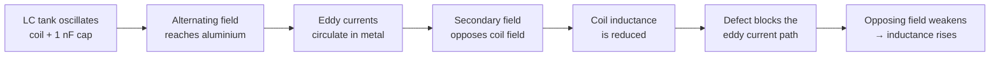
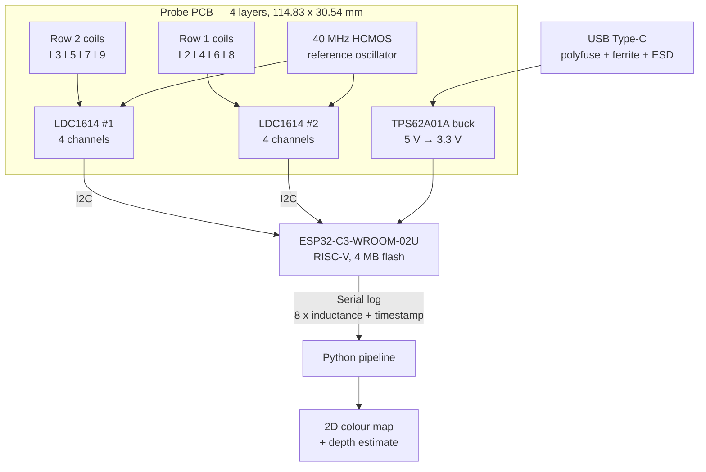
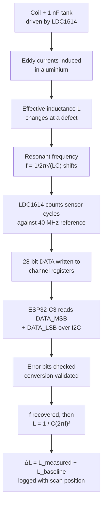
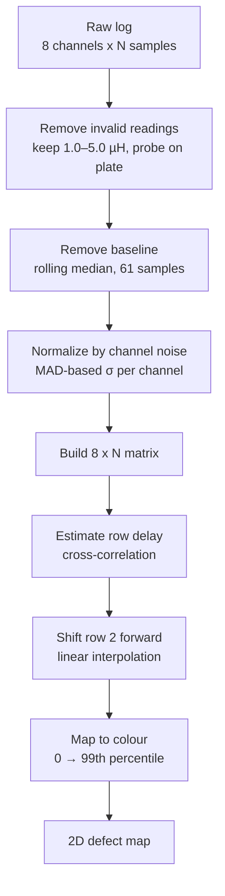
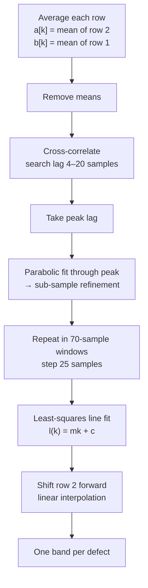
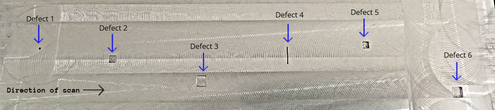

# ldc1614-eddy-current-array

An open-source eddy current array (ECA) probe for surface defect mapping and
depth characterization on aluminium.

Eight spiral coils are etched into a four-layer PCB. Two Texas Instruments
LDC1614 inductance-to-digital converters read all eight coils, an
ESP32-C3 streams the data, and a Python pipeline turns it into a 2D color
map of the scanned surface.


## Contents

- [Overview](#overview)
- [Working Principle](#working-principle)
- [System Architecture](#system-architecture)
- [Hardware Design](#hardware-design)
- [Test Specimen](#test-specimen)
- [Sensing Chain](#sensing-chain)
- [Data Processing](#data-processing)
- [Row Alignment](#row-alignment)
- [Results](#results)
- [Cost](#cost)
- [Repository Structure](#repository-structure)
- [Getting Started](#getting-started)
- [Future Work](#future-work)
- [License](#license)
- [Citation](#citation)
  
## Overview

Non-destructive testing (NDT) checks the condition of metal parts without
damaging them. Eddy current testing is well suited to conductive materials
because it needs no contact and gives results almost instantly.

A conventional single-coil probe covers only a small spot per pass, so a large
surface has to be scanned line by line. An **array probe** places several coils
side by side and reads them all at once, covering a wide strip in a single pass.

Commercial ECA instruments do this well but are expensive and closed — the user
cannot reach the raw measurement data. ECAS-8 is a working eight-channel
alternative built entirely from low-cost, off-the-shelf parts, with every layer
of the design published here.

**What it does**

- Reads 8 sensing channels simultaneously
- Covers a **55 mm** wide strip in one pass
- Produces a 2D colour map showing defect position along **and** across the scan
- Relates inductance change to defect depth through a calibrated power law
- Gives full access to raw inductance data

---

## Working Principle



Each coil is connected in parallel with a 1 nF capacitor to form an LC tank. The
LDC1614 drives the tank into sustained oscillation, so an alternating magnetic
field forms around the coil.

When the probe is over the aluminium plate, that field induces circulating eddy
currents in the metal. These currents create their own field that opposes the
coil's field, which **reduces** the coil's effective inductance.

A notch or crack interrupts the eddy current path. The opposing field becomes
weaker, so the inductance **rises** back towards its free-air value. That rise is
the defect signal.

Because the tank capacitance is fixed, any change in `L` shifts the resonant
frequency:

```
f = 1 / (2π · √(L · C))
```

The problem is therefore moved from the inductance domain into the frequency
domain, where it can be measured very precisely.

Eddy currents stay near the surface. Their penetration is described by the
standard depth of penetration:

```
δ = 1 / √(π · f · μ · σ)
```

---

## System Architecture




## Hardware Design

Everything — schematic, four-layer stack-up, PCB layout, and the spiral coil
geometry — was designed in **KiCad 9.0.0**.

### Main Components

| Block | Part | Notes |
|---|---|---|
| Microcontroller | Espressif ESP32-C3-WROOM-02U-N4 | RISC-V single core, 4 MB flash, 15 GPIO, Wi-Fi + BLE 5 |
| Inductance sensing | TI LDC1614RGHR × 2 | 4-channel, 28-bit, 1 kHz – 10 MHz sensor range |
| Reference clock | CTS 625L3C040M00000 | 40 MHz HCMOS oscillator, SMD 4-pad |
| Voltage regulator | TI TPS62A01ADRLR | Synchronous buck, 5 V → 3.3 V |
| USB interface | Molex 2171790001 | Type-C, right angle, with 1 A polyfuse, ferrite bead and ESD diode |
| Tank capacitor | 1 nF | One per coil, in parallel |

### Coil Design

The coils are **square planar spirals**. Square was chosen over circular because
it encloses more area for the same outer dimension — a square encloses `d²`
against `πd²/4` for a circle, roughly 27 % more. Saturn PCB Toolkit confirmed
20–25 % more inductance for the same footprint and turn count. With eight coils
sharing a small board, that extra inductance per unit area matters.

**Fixed parameters**

| Parameter | Symbol | Value |
|---|---|---|
| Outer diameter | d_out | 10.000 mm (393.7 mil) |
| Track width | w | 0.127 mm (5 mil) |
| Track spacing | s | 0.127 mm (5 mil) |
| Track pitch | p = w + s | 0.254 mm (10 mil) |
| Copper thickness | t | 35 µm (1 oz) |
| Tank capacitance | C | 1 nF |

Track width and spacing were set to 5 mil, the smallest the manufacturer could
produce reliably.

**Choosing the number of turns**

Inner diameter, average diameter and fill ratio follow from the turn count:

```
d_in  = d_out − 2np + 2s
d_avg = (d_out + d_in) / 2
ρ     = (d_out − d_in) / (d_out + d_in)
```

Inductance is calculated with the modified Wheeler expression (Mohan et al.),
using K₁ = 2.34 and K₂ = 2.75 for a square spiral:

```
L = K₁ · μ₀ · (n² · d_avg) / (1 + K₂ · ρ)
```

Inductance does **not** rise indefinitely with turns. The `n²` term pushes it up,
but the shrinking inner opening pulls `d_avg` down and drives `ρ` towards 1,
which pushes it back down.

| Turns, n | d_in (mm) | d_avg (mm) | L (µH) |
|---|---|---|---|
| 14 | 3.142 | 6.571 | 1.555 |
| 15 | 2.634 | 6.317 | 1.605 |
| 16 | 2.126 | 6.063 | 1.638 |
| 17 | 1.618 | 5.809 | 1.654 |
| **18** | **1.110** | **5.555** | **1.654** |
| 19 | 0.602 | 5.301 | 1.637 |
| 20 | 0.094 | 5.047 | 1.605 |

**18 turns** was selected — peak inductance while still leaving a 1.11 mm inner
opening. At 20 turns the opening collapses to 0.094 mm and the coil is
effectively solid copper.

Saturn PCB Toolkit returned 1652.79 nH against the calculated 1.654 µH, agreeing
within 0.1 %.

**Resonant frequency** with L = 1.65 µH and C = 1 nF:

```
f = 1 / (2π · √(1.65 µH × 1 nF)) = 3.9 MHz
```


### PCB Layout

Four layers were used for signal integrity. Signals run on the outer layers,
with a ground plane directly beneath the top layer to give a low-impedance
return path for the high-frequency sensor traces and to keep EMI down.

```
Layer 1  ──  Top copper      (signal)
Layer 2  ──  Ground plane
Layer 3  ──  +3.3 V plane
Layer 4  ──  Bottom copper   (signal)
```

| Design parameter | Value |
|---|---|
| Board dimensions | 114.83 × 30.54 mm |
| Layers | 4 |
| Minimum track width | 0.127 mm |
| Minimum trace spacing | 0.127 mm |
| Hole-to-hole clearance | 0.25 mm |
| Copper-to-edge clearance | 0.5 mm |
| Differential pair width | 0.2 mm (individual) |
| Via diameter | 0.6 mm, 0.5 mm |
| Coil pitch | 13 mm |

<!-- IMAGE: layer stack-up diagram -->
<!-- IMAGE: top copper layer -->


<!-- IMAGE: inner layer 2, ground plane -->


<!-- IMAGE: inner layer 3, +3.3 V plane -->


<!-- IMAGE: bottom copper layer -->


<!-- IMAGE: KiCad 3D render of the assembled board -->


### Coil Arrangement

The eight coils are not in a single line. They sit in two rows, one behind the
other along the scan direction:

```
   Scan direction  ──────▶

   Row 2:    [L3]   [L5]   [L7]   [L9]     ← crosses a defect first
   Row 1:  [L2]   [L4]   [L6]   [L8]       ← crosses it shortly after

           ◀────── 55 mm scan width ──────▶
```

This staggering gives continuous coverage across the full probe width, but it
means each defect is seen twice in the raw data. The
[row alignment](#row-alignment) step corrects this.

<!-- IMAGE: coil position diagram showing L2-L9 on the PCB -->


---

## Test Specimen

A **305 × 305 mm (12 × 12 in) pure aluminium plate, 10 mm thick**, machined with
artificial defects of known geometry.

**Calibration notches** — six straight-line notches, all 0.5 mm wide and 70 mm
long, at depths of 0.1, 0.2, 0.4, 0.8, 1.2 and 1.5 mm, spaced 5 cm apart.

**Shape and area defects**

| Type | Size | Depths (mm) | Qty |
|---|---|---|---|
| Straight-line notch | 70 mm × 0.5 mm | 0.1, 0.2, 0.4, 0.8, 1.2, 1.5 | 6 |
| Square | 1 × 1 mm | 0.2, 1.0 | 2 |
| Square | 4 × 4 mm | 0.2, 0.5, 1.0, 1.5 | 4 |
| Square | 6 × 6 mm | 0.2, 0.5, 1.0, 1.5 | 4 |
| Straight-line notch | 10 mm × 0.5 mm | 0.5, 1.5 | 2 |

<!-- IMAGE: Fusion 360 model of the specimen -->


<!-- IMAGE: photo of the machined aluminium plate -->


---

## Sensing Chain



**Frequency from the register value**

```
f_SENSOR = D × (DATA / 2²⁸) × (f_REF / R)
```

where `DATA` is the 28-bit result, `f_REF` = 40 MHz, `D` is the input divider
and `R` is the reference divider.

**Conversion time**

```
t_CONV = (REF_COUNT × 16) / f_REF
```

A larger `REF_COUNT` gives better resolution but slower scanning — it is set as a
compromise between the two.

**Inductance and defect indicator**

```
L  = 1 / (C · (2πf)²)
ΔL = L_measured − L_baseline
```

<!-- IMAGE: sensing chain flow diagram from the thesis -->


---

## Data Processing

The raw output is a table where each row is one time sample and each column is
one of the eight channels.



**1. Remove invalid readings.** The LDC1614 occasionally returns an error code,
and at the start and end of a scan the probe is not fully on the plate. Readings
below 1.0 µH or above 5.0 µH are discarded, and the eight-channel mean is used to
confirm the probe is on the specimen.

**2. Remove the baseline.** Every channel has its own baseline inductance, and it
drifts slowly during a scan from lift-off variation. A rolling median over a
61-sample window gives the local baseline:

```
ΔLᵢ = Lᵢ − median(Lᵢ)
```

Only the fast change caused by a defect survives.

**3. Normalize by channel noise.** The eight coils are not identical, so noisier
channels would look stronger even over clean metal. Each channel's noise level is
estimated from the median absolute difference between successive samples:

```
σᵢ = median |ΔLᵢ[k+1] − ΔLᵢ[k]| / 0.9539
```

The constant 0.9539 converts that median difference into a standard deviation for
Gaussian noise. Each channel is then divided by its own σ:

```
Sᵢ = ΔLᵢ / σᵢ
```

A value of 1 means one noise level from baseline; 20 means twenty. All eight
channels now share a single comparable scale.

**4. Map to colour.** The normalized values form an 8 × N matrix — rows are
channels, columns are time samples — drawn as a colour map. The scale runs from 0
to the 99th percentile of the data, through pale yellow → orange → dark red.
Invalid samples are grey so they are never mistaken for a weak response.

Clean metal appears pale yellow. A notch appears as a band across the channels
that passed over it.

---

## Row Alignment

Because row 2 (L3, L5, L7, L9) reaches a defect before row 1 (L2, L4, L6, L8),
each defect produces two separate bands. Alignment removes that delay.



**Estimating the delay.** The four channels of each row are averaged into one
signal, means are removed, and the cross-correlation is computed over trial
delays:

```
R(l) = Σₖ (a[k] − ā)(b[k − l] − b̄)
```

The delay is the `l` that maximises `R(l)`. The search is restricted to 4–20
samples so the correlation cannot lock onto a wrong peak.

**Sub-sample refinement.** The true delay is not an exact multiple of the sample
period, so a parabola is fitted through the correlation peak and its two
neighbours:

```
δ = ½ · (R₋₁ − R₊₁) / (R₋₁ − 2R₀ + R₊₁)
```

**Allowing the delay to drift.** The probe is hand-driven, so speed is not
constant. The row offset is a fixed *distance*, which corresponds to a longer
*time* when the probe moves slower — so the delay changes during a scan. The scan
is split into overlapping 70-sample windows stepped by 25 samples, the delay is
estimated in each, and a straight line is fitted by least squares:

```
l(k) = m·k + c
```

A window-to-window spread above 3 samples flags an unsteady scan speed.

**Applying the correction.** Row 2 is shifted forward by the fitted delay using
linear interpolation between neighbouring samples:

```
Sᵢ_aligned[k] = Sᵢ(k + l(k))
```

Row 1 is left unshifted as the reference. Samples that would need data from
beyond the recording are marked invalid and shown in grey.

---

## Results

### Part 1 — Straight-Line Notches of Increasing Depth

The first test used the six calibration notches machined into the aluminium
plate. All six are 70 mm long and 0.5 mm wide, and only the depth changes:
0.1, 0.2, 0.4, 0.8, 1.2 and 1.5 mm, spaced 5 cm apart. The probe was moved in a
single straight pass across all six.

<p align="center">
  
</p>
<p align="center"><em>Fig. 1: Test specimen with six straight-line notches of 70 mm length and 0.5 mm width, at depths from 0.1 mm to 1.5 mm.</em></p>

#### Channel Response

The measured inductance of all eight channels during the pass is shown below.
Each notch produces a clear rise in inductance as the coils cross it.

<p align="center">
  
</p>
<p align="center"><em>Fig. 2: Measured inductance of all eight channels during a single pass over the six notches.</em></p>

The inductance rises rather than falls at a defect, which is the expected
behaviour. Over intact metal, eddy currents circulate freely and their opposing
magnetic field reduces the coil's effective inductance. A notch interrupts that
current path, so the eddy currents weaken, the opposing field weakens with them,
and the inductance moves back up towards its free-air value.

The size of that rise grows with notch depth — a deeper notch removes more
material from the eddy current path, so the disruption is larger. All four coils
within a row respond almost identically, confirming that the eight channels
behave consistently.

#### Two-Dimensional Defect Map

Combining the eight processed channels gives the final output of the device: a
two-dimensional map of the scanned strip.

<p align="center">
  
</p>
<p align="center"><em>Fig. 3: Test specimen and the corresponding response map of all eight channels. Colour indicates the normalized response of each coil; dimensions in millimetres.</em></p>

The horizontal axis is the scan position and the vertical axis is the sensor
channel, from L2 at the bottom to L9 at the top. The colour bar shows how far
each reading sits from that channel's own baseline, measured in units of its own
noise level. Because every channel is scaled by its own noise, all eight can be
compared on a single colour scale despite having different baseline inductances.

Pale yellow is intact metal. A notch appears as a band running across the
channels that passed over it, darkening as the response grows stronger. Grey
marks samples where no valid measurement exists.

Five bands are clearly visible, and their colour deepens steadily from left to
right, matching the increasing notch depth: the 0.2 mm notch gives a light orange
band while the 1.5 mm notch gives the darkest band of the scan. The 0.1 mm notch
is present in the numerical data but too weak to separate from the background at
this colour scale, placing it at the detection limit of the device in this
configuration.

#### Relation Between Response and Depth

The scan was repeated three times. The mean inductance change for each notch is
listed below.

| Notch | Depth (mm) | Mean ΔL (µH) | Peak L (µH) |
|---|---|---|---|
| 1 | 0.1 | 0.052 | ≈ 3.62 |
| 2 | 0.2 | 0.069 | ≈ 3.64 |
| 3 | 0.4 | 0.117 | ≈ 3.69 |
| 4 | 0.8 | 0.166 | ≈ 3.74 |
| 5 | 1.2 | 0.201 | ≈ 3.77 |
| 6 | 1.5 | 0.226 | ≈ 3.80 |

The response increases for every step in depth, so the device distinguishes
between notches of different depth rather than merely detecting their presence.
The deepest notch gives a change more than four times larger than the shallowest.

The increase is not linear. It is rapid for shallow notches and flattens as the
notch deepens. A power law describes the measured points closely:

```
ΔL = 0.184 · d^0.56          R² = 0.995
```

The exponent of 0.56 is close to 0.5, meaning the response grows roughly with the
square root of notch depth.

<p align="center">
  
</p>
<p align="center"><em>Fig. 4: Inductance change against notch depth, with the fitted power law and standard deviation error bars.</em></p>

Expressed against the baseline inductance, the change runs from about **1.5 %**
at 0.1 mm to **6.3 %** at 1.5 mm. These are large enough for the LDC1614 to
resolve directly, so no amplification stage is required in the design.

The scatter stays between 0.014 and 0.031 µH and does not grow with depth. Since
the signal grows while the scatter does not, deeper notches are measured with
higher confidence. The 0.1 mm notch gives 0.052 µH against a scatter of
0.016 µH — about three times the noise, which is detectable but marginal.

> This relation is an **empirical calibration**. All six notches are 0.5 mm wide,
> so it applies to that width, and it should not be extrapolated beyond the depth
> range tested.

---

### Part 2 — Defects of Different Shape and Area

The second test used six defects that vary in shape, area and depth rather than
depth alone. The probe was moved in a single pass from Defect 1 through to
Defect 6.

<p align="center">
  
</p>
<p align="center"><em>Fig. 5: Test specimen showing the six artificial defects and the scan direction.</em></p>

| Defect | Shape | Size | Depth (mm) |
|---|---|---|---|
| 1 | Square | 1 × 1 mm | 1.0 |
| 2 | Square | 4 × 4 mm | 1.0 |
| 3 | Square | 6 × 6 mm | 1.0 |
| 4 | Straight line | 10 mm long, 0.5 mm wide | 1.5 |
| 5 | Square | 4 × 4 mm | 1.5 |
| 6 | Square | 6 × 6 mm | 1.5 |

#### Two-Dimensional Defect Map

<p align="center">
  
</p>
<p align="center"><em>Fig. 6: Test specimen and the corresponding response map of all eight channels. Shaded bands connect each defect to its position on the map. Dimensions in millimetres.</em></p>

The map reproduces the actual defect layout in **two dimensions**. Defect 2 sits
near 50 mm and appears on channels L6 and L7; Defect 3 near 118 mm on L4 and L5;
Defect 5 near 235 mm on L8; Defect 6 near 285 mm on L3. In every case the
position along the scan matches the defect's position on the plate, and the
responding channel matches its position across the plate width.

This is the central advantage of an array over a single coil. A single-coil probe
reports only that something was found somewhere along its path; the array reports
where along the scan **and** where across the width, in one pass.

Response strength follows both area and depth. Defect 6 — the largest and deepest
at 6 × 6 mm and 1.5 mm — gives the darkest band of the scan. Defect 3 has the
same area but only 1 mm depth, and responds more weakly. Defect 2, at 4 × 4 mm
and 1 mm deep, gives the weakest of the four clear responses. Both dimensions
contribute, and the largest, deepest defect produces the strongest signal.

#### Effect of Defect Width

Defect 4 is a 10 mm straight line, as deep as Defect 6 at 1.5 mm, yet it produces
only a faint response near 172 mm and 183 mm — far weaker than any of the square
defects.

The reason is its width. A 0.5 mm wide line removes very little material from the
eddy current path compared with a square several millimetres on each side, so the
disturbance to the circulating current is small. Depth alone does not determine
the response; the area presented to the coil matters just as much.

#### Detection Limit

Defect 1, a 1 × 1 mm square, produces no visible band anywhere on the map. Its
area is very small compared with the 10 mm coil, so only a tiny fraction of the
eddy current path is disturbed and the resulting inductance change cannot be
separated from the background.

**Summary of limits in this configuration**

- Smallest reliably detected area: **4 × 4 mm**
- Below detection: **1 × 1 mm**
- Shallowest detected depth: **0.1 mm**, at roughly three times the measurement
  scatter
- Scan width covered per pass: **55 mm**
## Cost

**Prototype cost** — PCBWay quotation T-I4W1066372A, five-unit build, April 2026.

| Item | Part | Qty | Cost / board (USD) |
|---|---|---|---|
| Inductance-to-digital converter | TI LDC1614RGHR | 2 | 6.096 |
| Wi-Fi / BLE MCU module | ESP32-C3-WROOM-02U-N4 | 1 | 3.048 |
| 40 MHz reference oscillator | CTS 625L3C040M00000 | 1 | 3.039 |
| USB Type-C connector | Molex 2171790001 | 1 | 1.092 |
| Buck converter | TI TPS62A01ADRLR | 1 | 0.137 |
| All other components | 22 line items | 48 | 8.467 |
| **Electronic components subtotal** | | **54** | **21.879** |
| PCB fabrication (incl. 8 etched coils) | | 1 | 11.644 |
| SMT assembly | | 1 | 5.800 |
| **Total per unit** | | | **39.32** |
| **Cost per sensing channel** | | | **4.92** |

**Against commercial instruments**

| System | Price (USD) | Channels | Cost / channel |
|---|---|---|---|
| Olympus OmniScan MX ECA | ≈ 40,000 | 32 | ≈ 1,250 |
| Eddyfi Ectane 2 (instrument only) | 13,500 | ≈ 32 | ≈ 420 |
| Evident / Olympus NORTEC 600D | 3,350 | 1 | ≈ 3,350 |
| **ECAS-8 (this work)** | **39.32** | **8** | **4.92** |

Commercial figures come from reseller listings where available; most NDT
manufacturers quote on request. They also exclude probes, encoders, scanners,
software licences and calibration blocks, so the gap shown is conservative.

---

## Repository Structure

```
ldc1614-eddy-current-array/
├── firmware/          ESP32-C3 firmware — LDC config, I2C read, serial logging
├── hardware/
│   ├── kicad/         KiCad 9.0.0 schematic and PCB project
│   ├── gerbers/       Fabrication files
│   └── bom/           Bill of materials
├── python/
│   ├── process_scan.py    Cleaning, baseline removal, normalization
│   ├── align_rows.py      Cross-correlation row alignment
│   ├── colour_map.py      2D map rendering
│   └── depth_fit.py       Power-law depth calibration
├── specimen/          Fusion 360 model of the test plate
├── data/              Sample scan logs
└── docs/              Figures and images
```

---

## Getting Started

### 1. Build the board

Send `hardware/gerbers/` to any PCB house — 4 layers, 114.83 × 30.54 mm, 5 mil
minimum track and spacing. Populate from `hardware/bom/`.

### 2. Flash the firmware

```bash
cd firmware
# Arduino IDE → Board: "ESP32-C3 Dev Module" → Upload
# or with PlatformIO:
pio run -t upload
```

### 3. Record a scan

1. Connect the probe over USB Type-C.
2. Rest it flat on a defect-free area of the specimen to capture the baseline.
3. Move the probe steadily along a straight path across the defects.
4. Save the serial output to a log file.

### 4. Process

```bash
cd python
pip install -r requirements.txt
python process_scan.py ../data/sample_scan.csv --out results/
```

This produces the colour map before and after alignment, plus the table of
detected indications.

---

## Future Work

- Encoder-based position tracking to remove dependence on steady hand speed
- Calibration curves covering a range of defect widths
- Extension to other conductive materials and to steel
- Real-time colour map display during scanning
- Mechanical guide for constant probe standoff

---

## Acknowledgements

Undergraduate thesis, Department of Electrical and Electronic Engineering,
**Khulna University of Engineering & Technology (KUET)**, Khulna-9203,
Bangladesh. August 2026.

Supervised by **Dr. Md. Rejvi Kaysir**, Professor, Department of Electrical and
Electronic Engineering, KUET.

Coil inductance modelling follows the modified Wheeler expression of Mohan et al.
Sensor and tank design follow Texas Instruments application notes SNOA930C,
SNOA957B and SNOU135A.

---

## License

<!-- FILL: e.g. MIT for firmware and Python, CERN-OHL-P v2 for hardware -->

---

## Citation

```bibtex
@thesis{neshat2026ecas8,
  author = {Istiuk Neshat},
  title  = {Design and Implementation of a Low-Cost Eddy Current Array System
            for Surface Defect Mapping and Depth Characterization},
  school = {Khulna University of Engineering \& Technology},
  year   = {2026},
  type   = {B.Sc. Thesis},
  note   = {Department of Electrical and Electronic Engineering}
}
```
